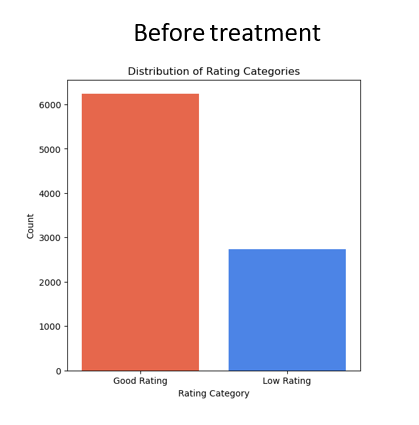

# Swiggy-Rating-Prediction

-------------------------------

# Flow of project

1. [Understanding problem statement](#1-problem-statement-swiggy-rating-prediction)
2. [Data import and Analysis](#2-data-import-and-analysis)
3. [Data Cleaning](#3-data-cleaning)
4. Base model.
5. Class imbalance treatment.
6. Exploratory Data Analysis (EDA)
7. Model after EDA
8. Feature selection
9. Model After Feature selection
10. Cross validation.

---------------------

## 1. Problem Statement: Swiggy Rating Prediction

- The goal of this project is to develop a predictive machine learning model that accurately forecasts the "Rating Category" for food delivery orders on Swiggy.
- We aim to leverage historical data comprising 17 diverse features, including aspects such as delivery time, order price, cuisine type, and more. 
- The "Rating Category" is a critical aspect of customer satisfaction and is indicative of the quality of service and food delivery.

---------------------

## 2. Data import and Analysis
- The dataset used in this project was obtained from Kaggle.

    ### Data Import:
    - The dataset was initially imported into **MySQL** for preliminary preprocessing. Subsequently, it was imported into Jupyter Notebook for further analysis and model development.

    ### Data Analysis
    - The dataset consists of `8976` rows.
    - The dataset comprises `17` features, each playing a unique role in predicting the "Rating Category." These features encompass various aspects related to **food delivery orders, such as order price, cuisine type, and delivery time**.

---------------------

## 3. Data Cleaning
- Data cleaning is a crucial step in preparing the dataset for analysis and modeling. This section outlines the various data cleaning procedures performed on the dataset to ensure its quality and suitability for further analysis.

    ### 3.1 Missing Value Treatment

    The initial examination of the dataset revealed the presence of missing values in specific columns. To address this, the following actions were taken:

    - **Missing Value Check:** An initial check for missing values was performed using `df.isnull().sum()`.

    - **Handling Missing Values:** The missing values in the "Area" column were addressed by filling them with the value "Sanjay Nagar New Bel Road," and the missing values in the "City" column were replaced with "Surat." These values were selected based on the dataset's context and relevance.

    ### 3.2 Dropping Unique Columns

    In the dataset, certain columns were identified as unique identifiers that do not contribute to the predictive modeling task. These columns were removed to streamline the dataset:

    - **ID Column:** The "ID" column was considered as a unique identifier and was removed.

    - **Restaurant Column:** The "Restaurant" column, also serving as a unique identifier, was dropped.

    ### 3.3 Datatype Conversion

    The dataset contains categorical variables that need to be converted to numeric form for machine learning model compatibility. This was achieved using Label Encoding:

    - **Label Encoding:** Label encoding was applied to the categorical columns in the dataset. The following steps were taken:
        - Extracted object-type columns using `df.select_dtypes(include=["object"])`.
        - Utilized LabelEncoder to convert these categorical columns into numeric representations.
        - The resulting label mapping was stored for reference.

    ### 3.4 Checking for Duplicates

    The presence of duplicate rows in the dataset was checked to ensure data integrity and accuracy:

    - **Duplicate Check:** The dataset was examined for duplicate rows using `df.duplicated()`. The total number of duplicates was reported.

These data cleaning steps were undertaken to prepare the dataset for subsequent analysis and modeling, ensuring the removal of missing values, unique columns, and proper datatype conversion while addressing duplicates.

---------------------

## 4. Base Model
- Establishing a base model is crucial to assess the initial performance of various machine learning algorithms and to establish a benchmark before conducting Exploratory Data Analysis (EDA).

    

    ### Observation (Base Model - Before EDA and Feature Selection)
    - The **Logistic** model achieved a low overall accuracy **but also struggled to achieve a balanced precision for class 1**.
    - The **DecisionTree** model demonstrated respectable accuracy and balanced precision and recall values for both classes.
    - The **RandomForest** model, although showing high accuracy, showcased the best balance between precision and recall for both classes.
    - The **Naive Bayes (NB)** model exhibited the **lowest overall accuracy and precision**, but it could be considered for its simplicity and potential for class 0 prediction.
    - The **XGBoost (XGB)** model presented a competitive balance between accuracy, precision, and recall.

    ### Conclusion (Base Model - Before EDA and Feature Selection)
    - The **RandomForest** model stood out for its balanced performance, making it a strong contender for classification tasks.

------------------------------------

## 5. Class imbalance treatment

- Tackling class imbalance through IMB Learn oversampling is essential to address the skewed distribution of target classes and enhance model performance by creating a balanced dataset.

-------------------------

## 6. Exploratory Data Anlysis

- Exploratory Data Analysis (EDA) encompasses outlier treatment and skewness correction, playing a pivotal role in understanding data distribution and ensuring the dataset's suitability for modeling.

    ### 6.1 Outlier treatment
    - Outlier treatment within the Exploratory Data Analysis (EDA) phase is vital for identifying and handling data points that deviate significantly from the norm, ensuring a more robust and reliable dataset for analysis and modeling.

    
    

    ### 6.2 Skewness Treatment
    - Skewness treatment, a crucial component of Exploratory Data Analysis (EDA), involves addressing data distribution imbalances to improve model accuracy and reliability by ensuring that features exhibit a more symmetric and normal distribution.

-------------------------------------------------

## 7. Model After EDA
- Building models after performing EDA, including outlier, class imbalance, and skewness treatment, is essential to harness the insights gained from data preprocessing and to create predictive models that can effectively capture the nuances of the dataset.

    

    ### Observation
    - After performing **class imbalance technique (IMB learn oversampling), outlier treatment, and skewness treatment**, we can observe **significant improvements** in **precision** compared to the base models.
    - **Random-Forest & XGB** model consistently demonstrate high accuracy, precision, recall, and F1-score values across both classes.
    - **Random-Forest & XGB** model excel in correctly classifying instances, with fewer false positives and a balanced trade-off between precision and recall.

    ### Conclusion
    - **Random-Forest or  & XGB** model will be well-suited for tasks where overall accuracy and reliability in predictions are crucial.

------------------------------------

## 8. Feature selection

- Feature selection was performed using Recursive Feature Elimination (RFE).

-------------------------------------

## 9. Model After Feature selection

- Developing models after feature selection using the Recursive Feature Elimination (RFE) method is akin to crafting a fine-tuned instrument, where only the most essential and harmonious features are retained, resulting in predictive models that are more efficient and precise.

    

    ### Observation
    - **After feature selection**, the models did not exhibit any major differences in their performance metrics.
    - Despite the reduction in the number of features, the DecisionTree, RandomForest, and XGB models continue to demonstrate high accuracy, precision, recall, and F1-scores.

    ### Conclusion
    - Model performance after feature selection showed **no significant changes**.
    - The **RandomForest** maintains its suitability for tasks where overall accuracy and precision are crucial.